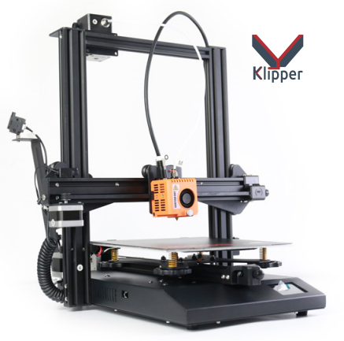

# Duplicator 12 230 EVO MEGA-KIT klipper config

Printer.cfg et firmware pour d12-230 evo mega-kit avec une carte 0327001-V3.0 et drivers TMC2225.

# **Guide d'installation du Klipper pour le D12-230 Evo Mega-Kit**

### **Avant de commencer : Important à savoir**
Cette procédure décrit comment installer Klipper sur votre imprimante 3D. Suivez chaque étape avec attention, car une erreur pourrait endommager votre matériel. Le processus a été testé, mais vous en êtes responsable. Assurez-vous de bien comprendre les instructions avant de commencer.

