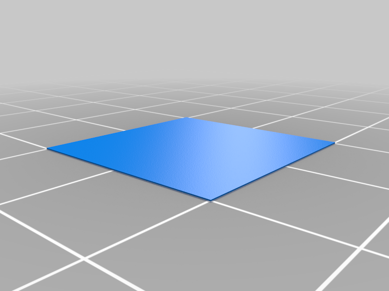

# **Klipper Installation Guide for the D12-230 Evo Mega-Kit**

**Printer.cfg** and **firmware** for **D12-230 EVO MEGA-KIT** with a **0327001-V3.0** board and **TMC2225** drivers.

### **Before You Begin: Important Information**
This procedure outlines how to install [KLIPPER](https://www.klipper3d.org/) on your 3D printer. Follow each step carefully, as errors could damage your hardware. The process has been tested, but you are responsible for any mishandling. Ensure you understand the instructions before starting.

### **Required Materials:**
1. **A Pad** pre-configured with KLIPPER (connected to your Wi-Fi network or via an Ethernet cable).
2. **USB Cable Type A male to Type B male** (preferably shielded to minimize interference).
3. **MicroSD Card** for updating the firmware.

### **Step 1: Download the Firmware**
1. Download the **`Robin_nano.bin`** file and the **`printer.cfg`** file from the [BL TOUCH](https://github.com/adnroboticsfr/duplicator-12-230-evo-mega-kit-klipper-config/tree/main/BL%20TOUCH) folder if your 3D printer is equipped with BL TOUCH (3D Touch), or from the [NO BL TOUCH](https://github.com/adnroboticsfr/duplicator-12-230-evo-mega-kit-klipper-config/tree/main/NO%20BL%20TOUCH) folder if it is not.

   

### **Step 2: Update the Printer Firmware**
1. Copy the renamed **`Robin_nano.bin`** file to the root of your MicroSD card. Ensure there are no other files on the MicroSD card except for the **`Robin_nano.bin`** file.
2. Insert the card into your printer and power it on.
3. The update will start automatically. **Do not turn off the power** during the update.

   

4. Once finished, remove the MicroSD card and restart the printer.

## Step 3: Connect the Pad/Device to the Printer
1. Connect the pad to your printer using the USB cable.
2. Ensure that your pad is properly connected to the network or via an Ethernet cable.
3. Access the Klipper interface by opening **`http://[pad IP address]`** in your web browser.

## Step 4: Configure Printer Settings
1. In the Klipper web interface, go to the **Machine** tab.

    

2. Replace the existing **`printer.cfg`** file with the one you downloaded from GitHub.
3. Click **Save** and then restart the printer to apply the changes.
4. The `printer.cfg` is optimized for general use, but remember to adjust it to suit your specific pad or needs.

## Step 5: Slicer Configuration (OrcaSlicer)
1. Download OrcaSlicer from the following link: [Download OrcaSlicer](https://github.com/SoftFever/OrcaSlicer/releases).
2. Add the **Wanhao D12 300** printer profile to the predefined printer profiles in OrcaSlicer.
3. Next, import the D12-230 profile available at the following link: [D12-230 Profile](https://github.com/Yumi-Lab/yumi-wiki/raw/main/Profile_Slicer/Orcaslicer/WanhaoD12Orcaslicer.zip). There are two versions: **with 3D Touch and without 3D Touch**.

    

4. The profile is optimized for general use, but don’t forget to adjust it to fit your specific 3D models.

## Step 6: Calibration and Adjustments Before Printing
1. **Extruder Calibration**  
   - Ensure the extruder is pushing the correct amount of filament.

2. **Z-offset Adjustment**  
   - Proper Z-offset calibration is essential for a good first layer.

3. **PID Tuning**  
   - Perform PID Tuning for both the extruder and heated bed to maintain stable temperatures.

4. **Resonance Test (ADXL)**  
   - If applicable, perform resonance testing with an ADXL sensor.

## **Recommended Tests Before Printing:**
1. **First Layer Test**: Ensure proper bed leveling with a specific test.

   

2. **Calibration Cube**: Print a 20x20x20 mm cube to check dimensions and extrusion.

   

Models are available on [Thingiverse](https://www.thingiverse.com/) and [Printables](https://www.printables.com/).

